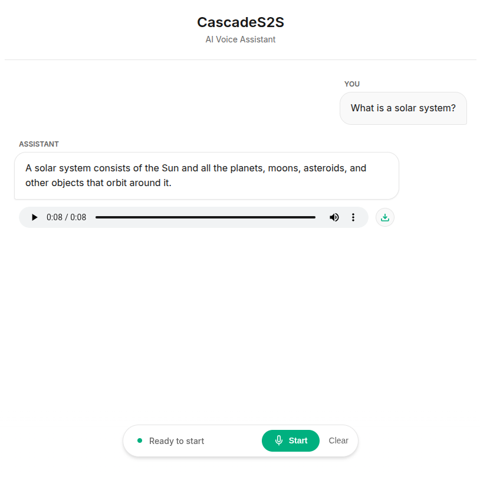

<div align="center">
<h1>Cascade Speech-to-Speech</h1>
<p>A real-time voice agent platform for natural conversations with AI. 
<br>Built with <b>FastAPI</b>, <b>WebSockets</b>, and <b>Redis</b>. Supported by <b>faster-whisper</b> and <b>Pocket TTS</b>.
</p>

  


</div>

## 🌟 Key Features

- **Real-Time Voice**: Dual-mode (Streaming & Batch) conversation with < 2s latency.
- **Optimized Stack**: `faster-whisper` for STT, `Qwen 2.5` (via Ollama) for LLM, and `Pocket TTS` for speech.
- **Smart Architecture**: Sentence-level streaming and voice state pre-loading for maximum speed.
- **Premium UI**: Modern dark mode interface with real-time transcription and latency metrics.

## 🚀 Quick Start

### 1. Requirements
Ensure you have **Docker** and **Docker Compose** installed.

### 2. Launch
```bash
./manage.sh start
```
The application will be available at [http://localhost:8000](http://localhost:8000).

### 3. Management
Use the provided script for easier control:
- `start / stop / restart`: Manage services.
- `logs`: Follow container logs.
- `clean`: Reset the environment.

## 🧪 Testing

Test the API directly using our CLI tool (requires `ffmpeg`):

```bash
# Real-time streaming test
./.venv/bin/python3 test_endpoints.py --mode stream

# Batch processing test
./.venv/bin/python3 test_endpoints.py --mode batch
```

## 🏗️ Architecture

- **`api/`**: FastAPI Gateway (WebSocket & REST).
- **`stt-worker/`**: Speech-to-Text via `faster-whisper`.
- **`llm-worker/`**: Language Model via `Ollama`.
- **`tts-worker/`**: Speech synthesis via `Pocket TTS`.
- **`shared_data/`**: Shared volume for efficient audio passing.

## 📄 License
This project is licensed under the MIT License.

