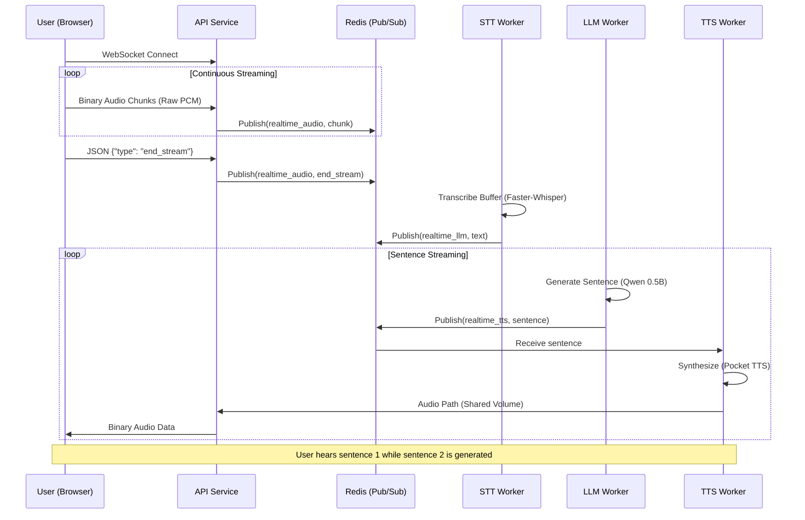

<div align="center">
<h1>Cascade Speech-to-Speech</h1>
<p>A real-time voice agent platform that enables natural conversations with AI. Built with microservices architecture using FastAPI, WebSockets, Redis, and powered by faster-whisper for 10x faster transcription.
</p>

    


</div>


## 🌟 Features

- **Real-Time Voice Conversations**: Talk directly to AI with minimal latency (< 2 seconds)
- **Microservices Architecture**: Distributed system with specialized workers for STT, LLM, and TTS
- **WebSocket Streaming**: Bidirectional audio streaming (Raw PCM) for live interactions
- **Faster-Whisper Integration**: 10x faster transcription compared to OpenAI Whisper
- **LLM Streaming**: Sentence-level streaming from Ollama (Qwen 2.5:0.5b)
- **Fast TTS**: Ultra-low latency speech synthesis using Kyutai Pocket TTS
- **Redis Communication**: Pub/Sub for real-time signaling and Lists for batch processing
- **Docker Orchestration**: Multi-container setup with shared volumes for efficient data passing
- **Beautiful Web Interface**: Premium dark mode UI with glassmorphism effects
- **Legacy Batch Support**: REST API for file-based processing

## 🏗️ Architecture

The project features dual-mode operation: **Real-Time** and **Batch Processing**.

```
├── api/               # WebSocket & REST API service
├── stt-worker/        # Speech-to-Text (faster-whisper)
├── llm-worker/        # Language Model (Qwen 2.5)
├── tts-worker/        # Text-to-Speech (Pocket TTS)
└── docker-compose.yml # Container orchestration
```

### System Components

| Component | Technology | Description |
| :--- | :--- | :--- |
| **API Gateway** | FastAPI | WebSocket management & REST endpoints |
| **STT Worker** | Faster-Whisper | Tiny model, Int8 quantization, 10x faster than Whisper |
| **LLM Worker** | Ollama / Qwen 2.5 | 0.5B model optimized for conversational streaming |
| **TTS Worker** | Pocket TTS | Kyutai Pocket TTS for ultra-fast synthesis |
| **Message Broker** | Redis 6.2 | Pub/Sub for real-time, Task Queues for batching |
| **Storage** | Shared Volumes | Efficient passing of audio files between containers |

### Real-Time Voice Agent Pipeline

The system uses a **Streaming-First** architecture to achieve near-instant responses.

1. **Web Interface**: Captures raw PCM audio chunks (16kHz, mono) and streams them via WebSockets.
2. **API Service**: Forwards binary audio to Redis Pub/Sub (`realtime_audio`).
3. **STT Worker**: Accumulates audio, transcribes it using `faster-whisper`, and publishes text to `realtime_llm`.
4. **LLM Worker**: Streams tokens from `Qwen2.5`. As soon as a sentence is completed, it's published to `realtime_tts`.
5. **TTS Worker**: Synthesizes speech using `Pocket TTS`. Uses voice state pre-loading for Alba Mackenna voice.
6. **Playback**: API reads the generated `.wav` from the shared volume and sends it back to the client.

#### Real-Time Data Flow



### Latency Optimization

To achieve sub-2-second latency on standard hardware, we implemented several key optimizations:
- **Sentence-Level Streaming**: The TTS starts working on the first sentence while the LLM is still generating the second.
- **Voice State Pre-loading**: TTS worker pre-computes speaker embeddings at startup to avoid re-calculation on every request.

## 🚀 Getting Started

### Installation

1. Clone the repository:
   ```bash
   git clone https://github.com/d1pankarmedhi/CascadeS2S.git
   cd CascadeS2S
   ```

2. Start the services:
   ```bash
   docker compose up --build
   ```
   *Note: On first startup, Ollama will automatically pull the Qwen 2.5:0.5b model. Subsequent starts will be immediate.*

### Management Script

For convenience, a `manage.sh` script is provided to handle common operations:

- **Start**: `./manage.sh start` (Builds and starts in detached mode)
- **Stop**: `./manage.sh stop`
- **Logs**: `./manage.sh logs` (Follow logs)
- **Status**: `./manage.sh status`
- **Pull Model**: `./manage.sh pull-llm` (Manually pull Qwen 2.5)
- **Clean**: `./manage.sh clean` (Remove containers and images)


## 🔌 API Specifications

### WebSocket: `/ws/voice`
- **Inbound (Binary)**: Raw PCM audio chunks (16-bit, 16kHz, mono).
- **Inbound (JSON)**: `{"type": "end_stream"}`
- **Outbound (JSON)**: `{"type": "transcription", "text": "..."}` or `{"type": "llm_response", "text": "..."}`
- **Outbound (Binary)**: WAV audio file data.

### REST: `/transcribe`
- **Method**: `POST`
- **Body**: `multipart/form-data` (file: `audio_file`)
- **Returns**: `{"job_id": "...", "status": "queued"}`


## 📄 License

This project is licensed under the MIT License - see the [LICENSE](LICENSE) file for details.

