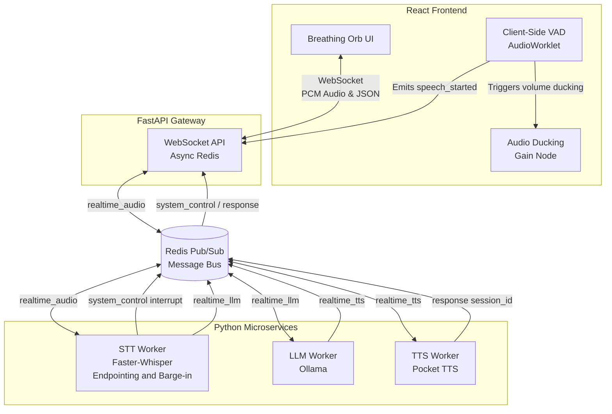
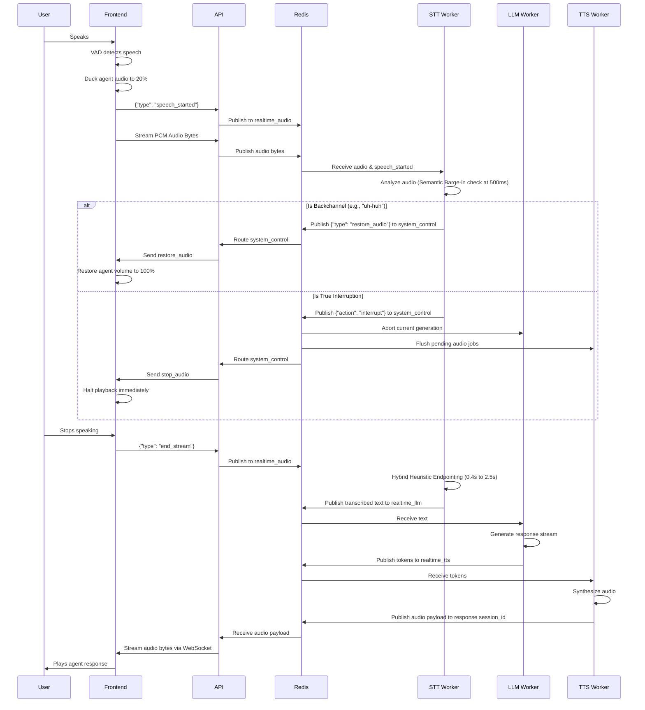

<div align="center">
<h1>Cascade Speech-to-Speech</h1>
<p>A low-latency, real-time voice agent platform featuring natural conversational turn-taking and semantic barge-in (interruption).
<br>Built with <b>FastAPI</b>, <b>React</b>, <b>WebSockets</b>, and <b>Redis</b>. Supported by <b>faster-whisper</b> and <b>Pocket TTS</b>.
</p>

   


</div>

## 🌟 Key Features

- **Real-Time Interruptible Voice**: "Duck and Decide" architecture allows you to instantly interrupt the AI ("barge-in") with sub-500ms latency.
- **Smart Turn-Taking**: Hybrid heuristic endpointing detects semantic boundaries (punctuation vs. filler words) to know exactly when you've finished speaking.
- **Semantic Barge-in**: Agent gracefully ignores non-verbal backchannels ("uh-huh", "yeah") without interrupting its own speech.
- **Modern React Frontend**: A beautiful, OpenAI-style "Breathing Orb" UI built with React, Vite, and Client-Side Web Audio API VAD (Voice Activity Detection).
- **Asynchronous API**: Highly optimized FastAPI gateway using `redis.asyncio` for zero-polling, fully non-blocking WebSocket streams.
- **Optimized AI Stack**: `faster-whisper` for fast STT, local LLMs (via Ollama), and `Pocket TTS` for speech generation.

## 🚀 Quick Start

### 1. Requirements
Ensure you have **Docker** and **Docker Compose** installed.
You will also need **Node.js** for the frontend.

### 2. Launch Backend Services
```bash
./manage.sh start
```

### 3. Launch Frontend UI
In a new terminal:
```bash
cd frontend
npm install
npm run dev
```
The application will be available at [http://localhost:5173](http://localhost:5173).

## 🏗️ Architecture

CascadeS2S relies on an event-driven microservice architecture connected via Redis Pub/Sub, allowing workers to operate concurrently and cancel ongoing generations instantly when an interruption occurs.



### System Components:
- **`frontend/`**: React/Vite application. Uses `AudioWorklet` for low-latency VAD. Ducks agent audio to 20% on user speech.
- **`api/`**: Async FastAPI Gateway. Relays WebSockets to Redis channels. 
- **`stt-worker/`**: Speech-to-Text. Evaluates semantics to determine turn boundaries and checks for true barge-in vs. backchannels.
- **`llm-worker/`**: Language Model. Streams tokens. Listens to `system_control` to halt generation instantly on interruption.
- **`tts-worker/`**: Speech synthesis. Aborts queued audio generation if the session is interrupted.

### Data Flow (Barge-In Sequence):


## 📄 License
This project is licensed under the MIT License.
